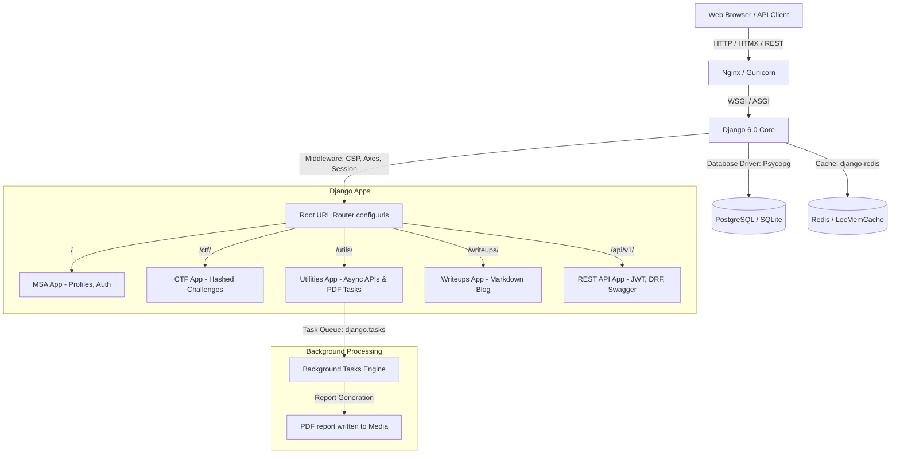

# Ethical Hacking Portal — System Architecture & Design Decisions

This document details the architectural layout, request flows, and security design decisions implemented in the Ethical Hacking Portal.

---

## 1. System Layout & Architecture

### Component Breakdown
1. **`config/` (Project Configuration):** Houses the root settings divided into 12-factor modules (`settings/base.py`, `settings/dev.py`, `settings/prod.py`), routing rules (`urls.py`), and WSGI/ASGI gateways.
2. **`MSA/` (Main Security App):** Manages core user authentication, details updates (dual forms logic), custom TOTP 2FA, and SVG initials avatar generation.
3. **`ctf/` (Capture The Flag Module):** Contains the gamified hacking challenges and attempts verification utilizing secure SHA-256 hashing.
4. **`utilities/` (Security Tooling):** Handles async operations (CVE lookup API and site security headers analyzer) and pentest PDF generation via tasks.
5. **`writeups/` (Markdown Blog):** Safe rendering of markdown tutorials sanitizing user inputs against stored XSS.
6. **`audit/` (Security Trails):** Captures logins, failed attempts, and key updates, rendering them immutable in the Django admin dashboard.
7. **`api/` (REST Layer):** Exposes DRF views, simplejwt endpoints, and automatically generates OpenAPI definitions via `drf-spectacular`.

---

## 2. Core Workflows & Request Cycles

### Custom TOTP 2FA Verification Flow
1. User enters username and password in `/login`.
2. Backend validates credentials. If valid:
   - Check if user has `totp_secret` in their `Profile`.
   - If **yes**: Store user's ID in `request.session['pre_2fa_user_id']`, display the TOTP token prompt page, and do **not** log the user in yet.
   - If **no**: Execute standard login redirect to dashboard.
3. On `/verify-2fa/` POST:
   - Verify 6-digit TOTP code using `pyotp.TOTP(secret).verify(token)`.
   - If correct: Complete session login (`login(request, user)`), clear temporary session variables, and redirect to dashboard.

### CTF Submission & Anti-Brute-Force Scoring
1. User submits a flag string through an HTMX inline form.
2. The view is rate-limited using `django-ratelimit` (`5 attempts/min`) to block automated scripting attacks.
3. Flag string is stripped and hashed using `SHA-256`.
4. The system compares the hash against `Challenge.flag_hash` (flags are never stored in plaintext).
5. If correct:
   - Query if user already submitted a correct flag for this challenge.
   - If not solved: Increment user's `Profile.points` by challenge value, save profile, log a `CTF_SOLVED` audit entry, and return a success notification.
   - If already solved: Return a warning (no duplicate points).

---

## 3. Core Security Design Decisions

### Stored XSS Prevention (Sanitized User Input)
For write-ups, markdown allows researchers to format their posts. However, rendering arbitrary HTML can leak cookies or session tokens via Cross-Site Scripting (XSS).
- **Remediation:** In `writeups/views.py`, the markdown output is piped through `bleach.clean()` with a strict tag and attribute whitelist (allowing standard text blocks, table cells, and styling spans/classes but stripping `script`, `iframe`, and event handlers like `onload`).

### EXIF Metadata Stripping (Privacy Protection)
Standard profile images contain EXIF tags documenting location data (GPS coordinates), software, and camera details.
- **Remediation:** During profile avatar uploads, our Pillow pipeline opens the file, reads raw pixel streams, discards metadata, converts the file to WebP format, crops it to a square, and saves it. This guarantees that GPS metadata is never leaked on the public profile cards.

### Content Security Policy (CSP)
We utilize Django 6.0's native CSP middleware to restrict unauthorized scripts, preventing malicious CDNs or inline injection scripts from running. Nonces (`{{ csp_nonce }}`) are injected into dynamically rendered pages to authorize approved inline scripts (like our CropperJS and ChartJS configuration scripts).
