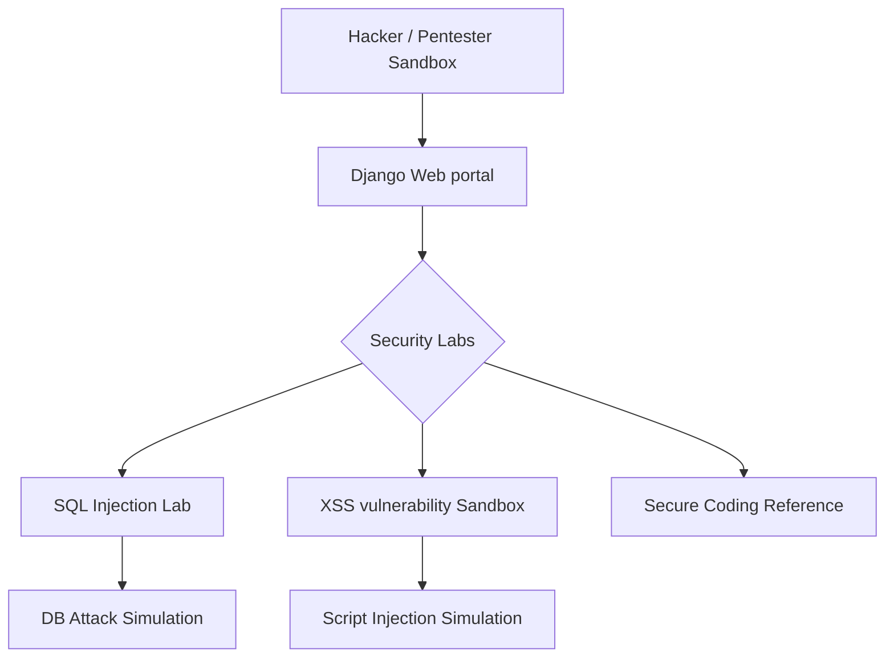

<!-- ========== NEW: ANIMATED WAVE HEADER ========== -->
<p align="center">
  
</p>

<!-- ========== NEW: TYPING ANIMATION INTRO ========== -->
<p align="center">
  
</p>

<!-- ========== NEW: AUTHOR & ARCHITECT SECTION ========== -->
## 👨‍💻 Author & Architect

<table>
<tr>
<td align="center" width="160">
  <a href="https://github.com/Sadique721">
    <br>
    <b>Md Sadique Amin</b><br>
    <sub>Backend Java Developer</sub>
  </a>
</td>
<td>

**Md Sadique Amin** — Backend Java Developer.

- 🔗 GitHub: [@Sadique721](https://github.com/Sadique721)
- 📧 Email: mdsadiqueamin721786@gmail.com
- 🏗️ Built: Enterprise BSS-OSS Telecom Suite, Backend Java Developer, IR Interconnect & Roaming

</td>
</tr>
</table>

<!-- ========== NEW: SYSTEM DIAGRAM SECTION ========== -->
## 📊 System Architecture & Workflow



---

# 🔒 Security Training & Penetration Testing Portal

[](https://www.djangoproject.com/)
[](https://www.django-rest-framework.org/)
[](https://django-rest-framework-simplejwt.readthedocs.io/)
[](https://getbootstrap.com/)
[](https://www.postgresql.org/)
[](https://www.docker.com/)
[](https://docs.pytest.org/)

An advanced, production-grade cybersecurity training platform designed for security researchers to solve CTF challenges, analyze security headers, search CVEs, and generate PDF pentest reports. Built using Django 6.0, Django REST Framework, custom TOTP 2FA security, HTMX, and containerized with Docker.

---

## 🌟 Key Features

*   **🏆 Capture The Flag (CTF) Module:** Gamified training module. Flags are validated using secure SHA-256 hashing. Submission rate-limiting via `django-ratelimit` prevents brute-forcing, and the leaderboard updates in real-time using HTMX.
*   **🛡️ Secure Custom 2FA (TOTP):** Two-factor authentication implemented in pure Python/Django using `pyotp` and base64 QR code rendering. Integrates seamlessly with Google Authenticator or Authy.
*   **🔎 Async CVE Lookup Tool:** Real-time lookup querying the National Vulnerability Database (NVD) REST API using Django 6.0's async views and `httpx`. Responses are cached locally via Django's caching framework.
*   **🔗 HTTP Security Header Analyzer:** Audits response headers (CSP, HSTS, X-Frame-Options) for public URLs, scoring configurations (A+ to F) and providing remediation insights.
*   **📄 PDF Report Generator:** Compiles pentest findings into a professional, dark-themed PDF report using ReportLab. Tasks are managed asynchronously via Django 6.0's new native background tasks framework (`django.tasks`).
*   **🧑💻 Profile & Image Pipeline:** Profile details with skill levels, specializations, social profiles, and points. Profile picture uploads are checked (max 2MB, formats), EXIF metadata is stripped to protect user privacy (prevents GPS leaks), and converted to `.webp` format.
*   **🔐 Hardened Security Controls:** Enforces native Django 6.0 Content Security Policy (CSP) headers, authentication lockouts (`django-axes`) for brute-force login shielding, and sanitized write-ups (using `bleach`) to block stored XSS.
*   **📊 REST API & Interactive Docs:** Exposes `/api/v1/` endpoints for profiles, challenges, and tools with JWT auth and auto-generated Swagger UI via `drf-spectacular` at `/api/docs/`.
*   **🐳 Containerized Environment:** Complete Docker + docker-compose orchestration bundling Django, PostgreSQL, and Redis cache.

---

## 📁 Repository Structure

```text
ethical-hacking-portal/
├── config/                 # Project Configuration (Renamed from myfirstpro)
│   ├── settings/           # 12-Factor Settings (base.py, dev.py, prod.py)
│   ├── urls.py             # Root URL Routing
│   ├── wsgi.py / asgi.py   # WSGI/ASGI Gateways
│   └── __init__.py
├── MSA/                    # Main Application Directory (Profiles, Auth)
│   ├── forms.py            # User Details & File Validators
│   ├── models.py           # User Profile & Contact schemas
│   ├── views.py            # Logical views & Auth controller
│   ├── views_2fa.py        # Custom 2FA registration & validation views
│   └── tests.py            # Unit tests (initals SVG, file validators)
├── ctf/                    # Capture The Flag Application
│   ├── models.py           # Challenge & Submission (SHA-256 checks, scoring)
│   ├── views.py            # Flag submission, rate limits, leaderboard
│   └── tests.py            # Pytest tests (flag verification, scoring signals, DRF API)
├── utilities/              # Cybersecurity tools
│   ├── tasks.py            # PDF report background task (ReportLab)
│   └── views.py            # Async CVE lookup & Header analyzer views
├── writeups/               # Markdown Blog
│   └── views.py            # Sanitized Markdown rendering (XSS protection)
├── audit/                  # Security Audit trail
│   ├── signals.py          # Intercepts login, logouts, failures & IPs
│   └── models.py           # Immutable Audit entries
├── api/                    # Centralized REST API routing
│   ├── views.py            # DRF ViewSets & Swagger-documented endpoints
│   └── urls.py             # JWT endpoints & Swagger UI urls
├── templates/              # HTML layout elements (HTMX, Terminal Dark Theme)
├── Dockerfile              # App container definition
├── docker-compose.yml      # Multi-container orchestrator (Django, Postgres, Redis)
├── pytest.ini              # Pytest configurations
└── requirements.txt        # Pinned packages
```

---

## 🐳 Quick-start: Run with Docker Compose

Running the entire stack (Django, PostgreSQL, and Redis) is simplified into a single command:

1. **Clone the repo and navigate to directory:**
   ```bash
   git clone https://github.com/Sadique721/ethical-hacking-portal.git
   cd ethical-hacking-portal
   ```
2. **Start the containers:**
   ```bash
   docker-compose up --build
   ```
3. **Run database migrations inside the container:**
   ```bash
   docker-compose exec web python manage.py migrate
   ```
4. **Create a superuser to access the Admin Panel:**
   ```bash
   docker-compose exec web python manage.py createsuperuser
   ```
5. **Access the portal:**
   - Web application: http://localhost:8000
   - Swagger API Documentation: http://localhost:8000/api/v1/docs/
   - Django Admin (modern Jazzmin theme): http://localhost:8000/admin/

---

## 🚀 Running Locally (Without Docker)

1. **Install python packages:**
   ```bash
   pip install -r requirements.txt
   ```
2. **Create local environment file:**
   Copy `.env.example` to `.env` and configure credentials:
   ```bash
   cp .env.example .env
   ```
3. **Execute database migrations:**
   ```bash
   python manage.py migrate
   ```
4. **Launch development server:**
   ```bash
   python manage.py runserver
   ```

---

## 🧪 Testing and Quality Control

We run a suite of unit and integration tests checking profile pipelines, CTF signals, and REST endpoints.

Run the test suite with coverage reporting:
```bash
pytest
```


<!-- ========== NEW: FOOTER WAVE ANIMATION ========== -->
<p align="center">
  
</p>